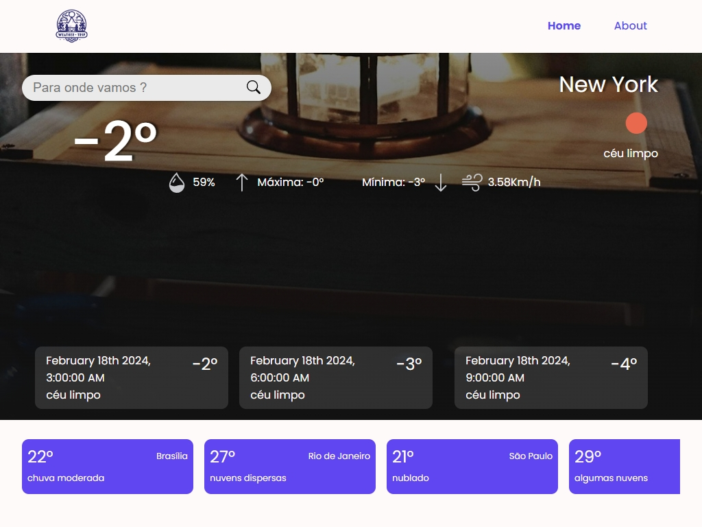
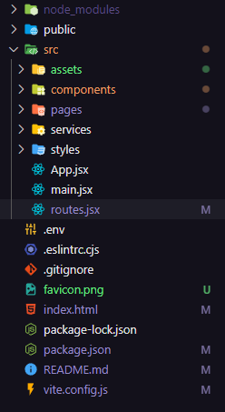
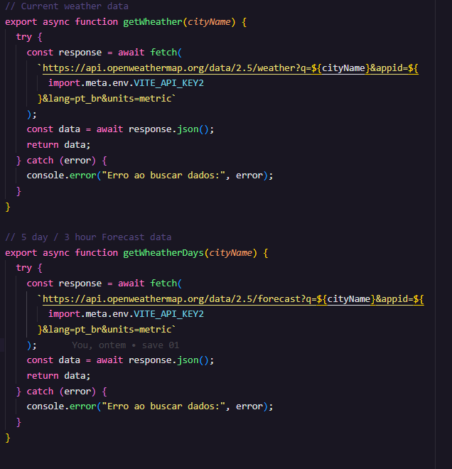
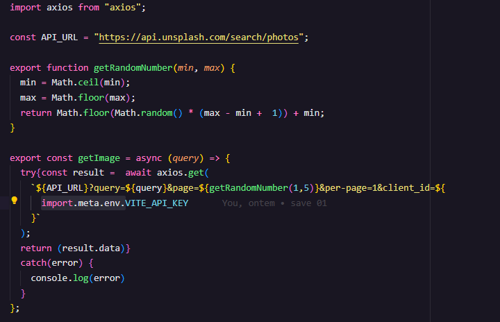

# WeatherTrip

WeatherTrip is a real-time weather forecast application. Using the OpenWeather API Current weather data API and 5 day / 3 hour Forecast API, the website integrates real-time weather conditions from any city in the world, as well as the conditions for the next 5 days (every 5 hours).

  
  

## Technologies used

- React
- Vite
- Styled Components
- CSS animations
- React Router DOM
- React-spinners (for loading Screen)
- date-fns
- Unsplash API
- OpenWeather API (high-resolution image data)

## Easy, Intuitive, and Beautiful Design-

## Responsive Design

### The entire site is fully responsive and adapts to any screen size

  

Note: In some browsers, such as Safari, the scroll track may not appear, but it works perfectly.

### Prerequisites

- Node.js
- npm ou yarn

### Project Structure

  

### API 

## OpenWeatherAPI

  

### Unsplash API

  

### Running the project

- Git Clone https://github.com/Joaommsp/weatherTrip-weatherApp
- cd weatherTrip-weatherApp
- npm run dev
